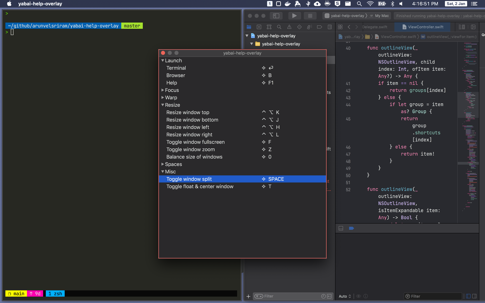

# yabai-help-overlay

Help overlay for [yabai](https://github.com/koekeishiya/yabai) inspired by [regolith-linux](https://regolith-linux.org/)'s help overlay.



## How it works?

The overlay (basically a window) is populated using comments provided in the [skhd](https://github.com/koekeishiya/skhd/) configuration `~/.skhdrc`.

Each skhd config has a comment in the below format:

```
# group : description
skhd config

# group : description
skhd config
```

For example:

```
# Launch : Terminal
hyper - return : open /Applications/Alacritty.app
# Launch : Browser
hyper - b : yabai-utils open-firefox

# Window : Focus top window
hyper - k : yabai -m window --focus north
...
```

My [`.skhdrc`](https://github.com/arunvelsriram/dotfiles/blob/master/skhdrc) for reference.

## Install

1. Download the package and move the application to `/Applications`
2. To open the help overlay using a keyboard shortcut add the below config to `~/.skhdrc`

```
# Launch : Help
hyper - f1 : yabai -m rule --add app="^yabai-help-overlay$" sticky=on layer=above manage=off && open /Applications/yabai-help-overlay.app
```

`hyper + f1` shows the overlay

